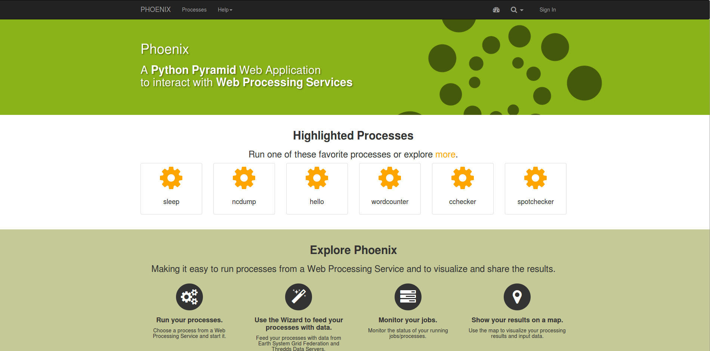

# 0. Web Processing Service (aka WPS)

## 0.1. What is WPS

[Web Processing Service (WPS)](http://opengeospatial.org/standards/wps) is part
of the OWS standards defined by OGC, while WFS, WMS, WCS, SOS are used for transfer
of data (upload, download, transformation?), WPS is used for data processing in
the server (All processing is done in server side).

WPS provides a standard interface for input, output, process discovery and
execution. WPS is normally used for geospatial data to run spatial processes.

One good example of WPS usage is provided by geoserver
([WPS-Geoserver](http://docs.geoserver.org/latest/en/user/services/wps/operations.html)),
where multiple geospatial processes are avaiable to be applied to the data
container in server

## 0.2. What is PyWPS

[PyWPS](http://pywps.org) is the a WPS implementation written in
[Python](http://python.org) language. Current version is 4.0.0 but version 3.2
still has a big comunity base.

- Server (HTTP-WSGI)
- OGC WPS implementation

## 0.3. What is NOT PyWPS

- A client - even it might be acting as WPS client, when calling subprocesses on
  other servers
- A GUI - PyWPS does not have any Graphical user interface, even this [might
  change in the future](https://github.com/geopython/pywps/pull/147)
- Server with pre installed processes / geotools - you might find some testing
  processes as part of PyWPS distribution, but PyWPS is meant for your own
  process deployment.

## 0.4. Who is using PyWPS

PyWPS has been used in multiple projects concerning geospatial data processing
probably now the biggest user is the [Birdhouse
project](http://bird-house.github.io/) and its [demo](https://mouflon.dkrz.de/)

List of scientifical publications: [here](http://pywps.org/science/) 

PyWPS gallery: [here](http://pywps.org/gallery/)

  

 

## 0.5. A brief introduction to WPS

WPS is part of the OGC service suit (OWS) and some operations are common to
other services (e.g. `GetCapabilities`), but others specific to WPS it self

#### **WPS requests:**

- GetCapabilities
- DescribeProcess
- Execute

**GetCapabilities**, it provides a list of available services.
**DescribeProcess**, describes a process indicating the input and output
required by the process to execute and/or metadata information.    

**Execute** request will accept an input/output, process conditions (async/sync)
and will run the process in the server/

#### **WPS async/sync**
 
Some processes are time consuming, so it is better to start the process and
later query the server for its status or output.  This is refered as a async
execute request

If you are confident that the process being executed is fast you can request a
sync execution where the client waits for the immeditely reply from server
withoutput (no need to pull the output later)  

#### **WPS input/output**

WPS are 3 sort of data I/O:

- **Literal** 
- **ComplexData** 
- **BoundingBox** 

The **Literal** is any number (float,int) and string. **ComplexData** is
geospatial data in multiple formats (mimetype, e.g: **application/gml+xml**) hat
can be integrated into the WPS request/response, when using vectorial data this
one is transformed into XML and raster binary data coded into base64 (binary
coding using ascii symbols)

## 0.6. WPS versions

WPS 1.0.0 was released in 2007, the new WPS 2.0.0 was released in 2015. So far
major implementations have only used WPS 1.0.0

## 0.7. PyWPS 4.0

Python has evolved **CONSIDERABLE** in the last 10 years, creating new
functionalities and chancing to new programming paradigms:

**PyWPS4.0.0:**
- Python 3 support
- Based on a webframework (werkzeug)
- More efficient XML parsing using `lxml` (`elementtree`, no DOM)
- Native WSGI itegration (Better server integration)
- MIT license (can be used in commercial projects)

 

## 0.8. WPS issues and problems 

WPS 1.0.0 can start processes, but there is no way to stop them before the
process reaches its conclusion....it is like a car without brakes.... Other
problems are related to the necessary technical know how to implement a service
meaning: Programming or integrating code necessary to generate a service

But not all is bad. New WPS2.0.0 allows for processes to be cancelled, other projects Geoserver/52North/Zoo/Grass-bridge have multiple processes already included or allow for easier integration. 

  
