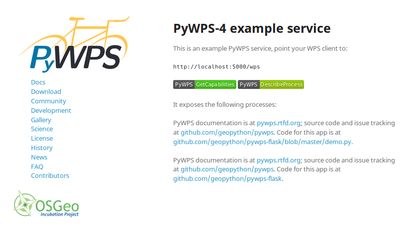

# 1. Installation

### 1.1. Requirements
 
Start by checking if your system meets the [required
dependencies](http://pywps.readthedocs.io/en/latest/install.html#dependencies-and-requirements). 

Most of the depencies are python packages, the most problematic packages are GDAL and lxml since they require compilation of C/C++ code and specific bindings (normally is enough to install them using linux package managers). The GDAL package is not required by pywps but a high number of processes require it 

```
apt install python-gdal
apt install python-lxml
``` 

The file `requirements.txt` is  used in python as a list of packages and source codes neceessary to run a system. If you are a developer it is advisable to install the `requirements-dev.txt` packages, those packages (e.g flake8) are convernient for code check and validation.

### 1.2. Install main library
 
Install PyWPS on your system [using
PIP](http://pywps.readthedocs.io/en/latest/install.html#download-and-install).

Consider using Python [virtualenv](http://python-guide-pt-br.readthedocs.io/en/latest/dev/virtualenvs/).

Or git clone and `setup.py`

```
git clone -b master https://github.com/geopython/pywps.git
cd pywps
python setup.py install
```

This will install pywps as a python library. Now in a python console should be possible to call the pywps module:
```
python -c "import pywps"
```

This bash command will load the pywps library and close the console. If the install was properly done no error messages will appear

### 1.3. Clone flask application
 
 
Now [clone the pywps-flask
service](http://pywps.readthedocs.io/en/latest/install.html#the-example-service-and-its-sample-processes).
Install the service requirements by entering the folder and using `pip`:

`git clone https://github.com/geopython/pywps-flask.git` 

`cd pywps-flask`

`sudo pip install -r requirements.txt`

Start the service by issuing the following command:  

`python demo.py`

Note, to use python3 it is necessary to use `pip3` instead of `pip`  and from the console run:

`python3 demo.py`

PyWPS-4.0 is build on top of [werkzeug](http://werkzeug.pocoo.org/) this library deals with HTTP requests and extra functionality. Normally we integrate PyWPS-4.0 into Flask webframe work for convenience. The difference from the above point (1.2) is that we can have a webpage + pywps + server

If everything went well you should have a console output as follow:
```
server->workdir configuration value workdir is not absolute path, making it absolute to /home/osgeo/pywps-flask.git/workdir
server->outputpath configuration value outputs is not absolute path, making it absolute to /home/osgeo/pywps-flask.git/outputs
 * Running on http://127.0.0.1:5000/ (Press CTRL+C to quit)
```

### 1.4. Service check
 
To test the service open your internet browser to this address:
[http://127.0.0.1:5000](http://127.0.0.1:5000).

You will be greeted with the system welcome page:

<p align="center"> 

</p>


### 1.5. Test PyWPS 
 
Test the WPS service itself using a *GetCapabilities* request; insert this
address in your browser:
[http://127.0.0.1:5000/wps?SERVICE=WPS&REQUEST=GetCapabilities](http://127.0.0.1:5000/wps?SERVICE=WPS&REQUEST=GetCapabilities)

(Or click on the green GetCapabilities button in the welcome page)

In the GetCapabilities XML document notice the following:

- Abstract describing service
- Service provider
- Process Offerings (Title, Abstract, Metadata)
- Languages


### 1.6. Configuration

PyWPS relies on a single configuration file, for service description and server options: pywps.cfg

### 1.6.1. Service description

There are several fields in the *GetCapabilities* that can be customized. 

Take some time to go through the [PyWPS configuration file
documentation](http://pywps.readthedocs.io/en/latest/configuration.html). 

Locate the file pywps.cfg and change the right fields in the configuration file so that your name and contacts
show as the service contact person. Test it again using the *GetCapabilities*
request.


**Tip:** PyWPS can detect a pywps.cfg in the following places:

Unix/Linux:
 1. root folder of source
 2. /etc/pywps.cfg
 3. $HOME/.pywps.cfg
 4. $PYWPS_CFG environment variable

Windows:
 1. pywps\\etc\\default.cfg
 2. PYWPS_CFG environment variable`

#### 1.6.2  Server configuration 
 
To avoid overloading the server it is possible to set limitations on the number of processes in queue or/and running in parallel and size of imports, in the server section. Other parameters like folder output and URL to output is also configured in this section

The output folder has to be publically accessible to outside since it will be used to  pull content generated by WPS

#### 1.6.2 Log configuration

PyWPS has currently 2 log options: File or Database

The log file is a simple text log that can be formated, while the database option will dump the log into a database using SQLAlchemy (Sqlite, Postgresql, MySQL, Oracle) 

We will focus on the logging capacilities of PyWPS in section `04-Logging`
