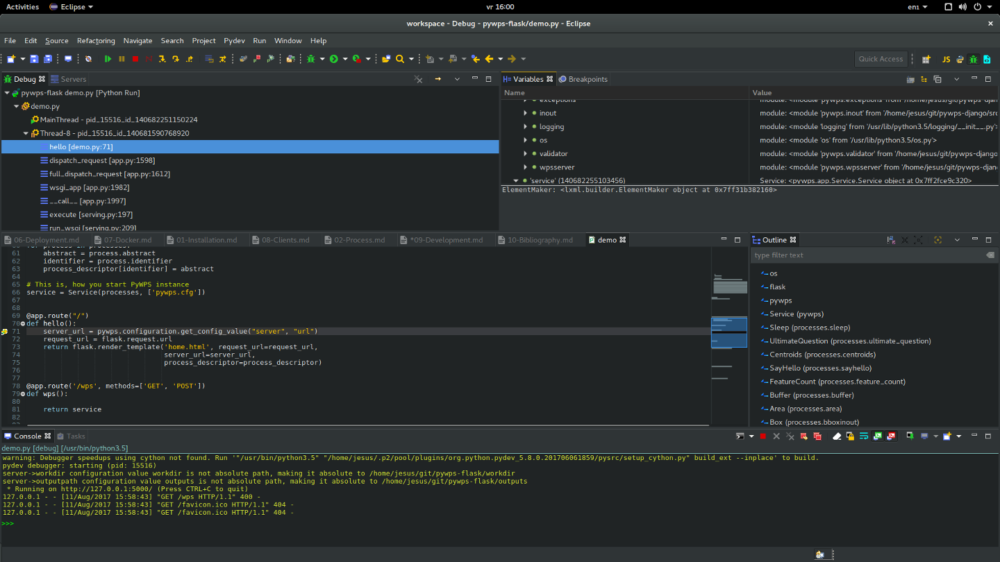

# 9. Development

PyWPS code base is not extensive but requires familiarity with Python, OO ([Object Oriented](https://en.wikipedia.org/wiki/Object-oriented_programming)) programing,  webservices and pradigmas like ORM [Object Relational Model](https://en.wikipedia.org/wiki/Object-relational_mapping)

The project's contribution file has a good snapshot of the requirements for code submission, testing, license and conduct [CONTRIBUTING.rst](https://github.com/geopython/pywps/blob/develop/CONTRIBUTING.rst)


## 9.1 Github  

Please consult the PyWPS developers [guide](http://pywps.readthedocs.io/en/latest/development.html)  on how to procesed in github to be a developer 

PyWPS development requires the folowing appoarch:

- Fork pywps into your account
- Open an issue explaining the problem (this is mainly when development is bug oritend)
- Develop/Fix the code in your fork
- Make a pull request indicating the number of the issue

The pull requests have to be approved by other community members

## 9.1 Requirements

The pywps projects normally contain a `requirements-dev.txt` list of python modules necessary for testing and developing proper code

```
pip install -r requirements-dev.txt
```

## 9.2 PyWPS API

Lets consult it in read the docs [here](http://pywps.readthedocs.io/en/master/api.html).

The most important aspect of the API are the classes that map the WPS structure e.g: Process,I/O


## 9.3 Test driven tools

Tests and tools used for code quality control

### 9.3.1 Unittests and Coverage

PyWPS is a [test development driven](https://en.wikipedia.org/wiki/Test-driven_development), meaning a lot of system funcionality can be used using external scripts. Check folder `tests/` for code examples. To run the tests

```
cd /home/user/pywps-flask
python -m unittest -v tests
```

*Tip:* The test folder from pywps repository has more tests than the on in pywps-flask
*Tip2:* Looking at Unittests is an excellent way to learn how to code PyWPS 

Coveraget is a benchmark on how much code is tested by the  unittests, the higher the coverage the higher the software qualirt
```
python -m coverage run --source=pywps -m unittest tests
python -m coverage report -m
```

What part of pywps's code needs the most attention???

### 9.3.2 Tox - Testing in multiple python interpreters

CPython has 2 man versions in the wild: 2.7 and 3.6, how developers test in different interpreters???  

Using `tox`, this tools created multiple virtualens and tests the pywps using different interpreters/packages

```
sudo apt install tox
sudo tox
```

The tox tool will pickup and configuration in `tox.ini` and test pyWPS. The OsGEO lacks the proper libraries for python3, this is indicated by tox
 

### 9.3.3 Flake8 - Proper code syntax and style

Python has a specific syntax and style, it is humanly impossible to track all the requirements, programmer can use the  `Flake8`  toll that will check the code syntax

```
flake8  flake8 ./pywps/app/Common.py
```

## 9.4 IDE

Each programmer has its own preference of development environment. Eclipse is a JAVA oriented IDE 

[http://www.eclipse.org/](http://www.eclipse.org/)

There is a plugin that can be installed ([pydev](http://www.pydev.org/)) allowing for python programmers to use the IDE. The major advantage of an IDE is the possibility of adding breaking points in the PyWPS code and when run the code will freeze in a certain point and the developer can evaluate the code and variables at run time




